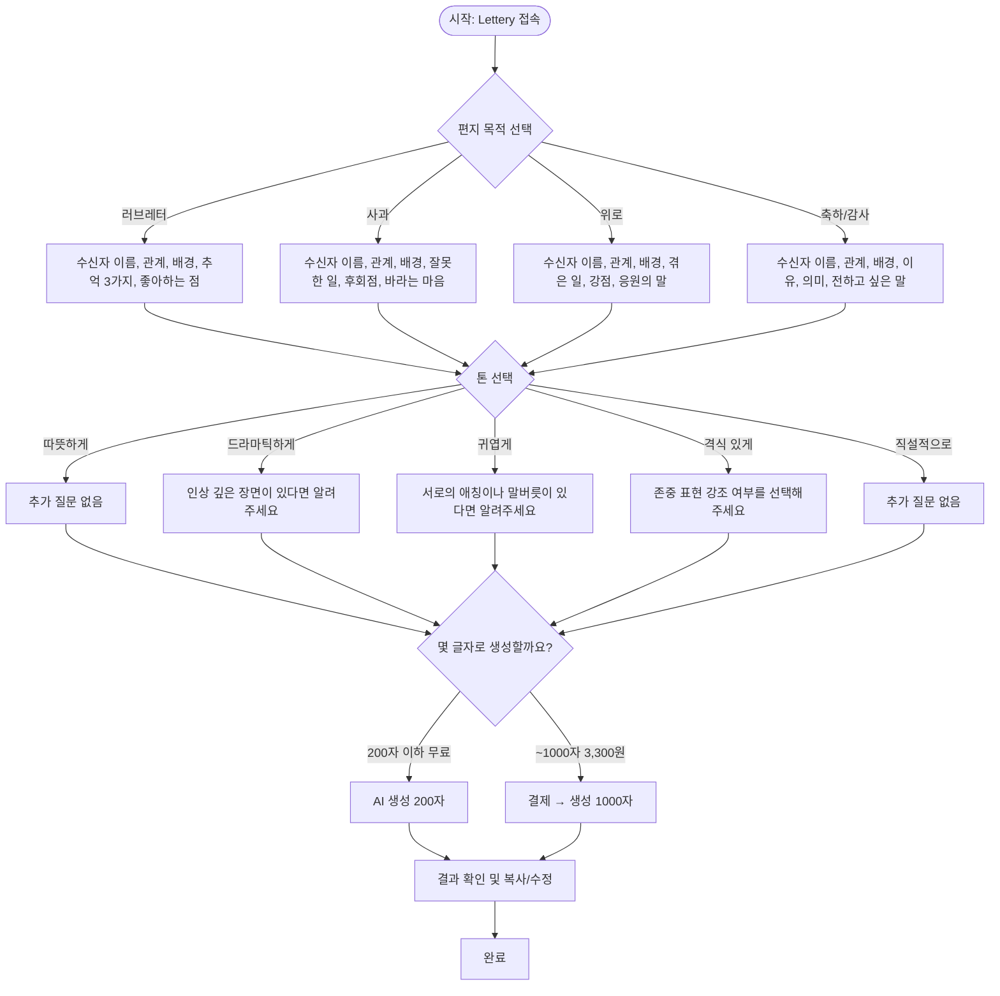

# 통합 기획서: Lettery 감정 대필 서비스 (플로우 변경 최종본)

## 1. 서비스 개요
Lettery는 수신자에 맞춘 편지, 장문 메시지를 AI가 대신 작성해주는 서비스입니다. 사용자가 특정 상황(러브레터, 사과, 위로, 감사 등)에 적절한 감정 메시지를 쉽게 작성할 수 있도록 돕습니다. 수신자 정보(이름, 관계), 상황 설명, 감정 등을 입력하면 AI가 감성적인 메시지를 자동 생성합니다.

---

## 2. 핵심 목표
- 사용자가 특정 상황에 적절한 감정 메시지를 쉽게 작성할 수 있도록 지원
- AI를 활용해 입력된 정보를 바탕으로 200자~1000자 내외의 편지 자동 생성
- 사용자 맞춤형 톤과 문체 조절 기능을 제공하여 개인화된 결과물 제공

---

## 3. 변경된 서비스 흐름
- **기존**: 입력 → 생성 → 글자수 확인 및 결제
- **변경**: 입력 → **글자 수 선택 → 결제 → 생성**

사용자가 결과물의 분량과 비용을 예측하고 제어할 수 있도록, AI 생성 전에 글자 수를 먼저 선택하고 결제하는 방식으로 플로우를 변경합니다.

---

## 4. 서비스 흐름도 (Mermaid)


---

## 5. 핵심 기능 (MVP 기준)

| 구분 | 기능 | 설명 |
|------|------|------|
| 입력폼 | 감정 목적 선택 | 러브레터, 사과문, 위로 메시지, 감사/축하 중 택 1 |
| 입력폼 | 기본 정보 입력 | 수신자 이름, 관계, 배경 설명 |
| 입력폼 | 목적별 질문 분기 | 각 감정 목적에 따라 다른 질문 세트가 동적으로 구성됨 |
| 입력폼 | 톤 프리셋 선택 | 따뜻하게, 귀엽게, 드라마틱하게, 진지하게, 유쾌하게 등 |
| 입력폼 | 톤에 따른 추가 질문 | 선택한 톤에 맞춰 보조 질문 분기 |
| **선택** | **글자 수 선택** | **AI 생성 전, 원하는 결과물의 분량과 가격을 선택** |
| **결제** | **글자 수 기반 결제** | **선택한 글자 수에 따라 단건 결제 연동** |
| 생성 | AI 편지 생성 | GPT 기반으로 선택된 분량에 맞춰 문장 자동 생성 |
| 결과 | 결과 확인 및 수정 | 생성된 편지 내용을 보여주고, 수동 수정, 복사, 다시 만들기 기능 제공 |
| 결과 | 복사하기 기능 | 생성된 편지를 클립보드에 복사 |
| 결과 | 다시 생성하기 | 같은 입력값으로 다른 버전의 편지 생성 |

---

## 6. 입력 항목 상세

### 공통 입력
- 수신자 이름: 텍스트
- 관계: 드롭다운 또는 텍스트
- 배경 요약: 텍스트 (3~5줄)

### 목적별 추가 입력
(러브레터, 사과문, 위로, 감사 편지 각각에 맞춘 질문 세트 구성)

### 톤 프리셋
- 따뜻하게 / 드라마틱하게 / 귀엽게 / 격식 있게 / 직설적으로

### 글자 수 & 가격 선택
- UI/UX 고려사항:
  - 예상 가격 함께 표시
  - A4 기준 길이 안내 (ex. 1000자 = A4 반쪽)
  - 사용 예시 문구 미리보기 제공

| 글자 수 | 가격 | 예시 상황 | 길이 감각 |
|--------|------|-----------|-----------|
| 200자 이하 | 무료 (일 3회) | 짧은 축하, 감사, 톡 메시지 | 1~2 문단 |
| ~1000자 | 3,300원 | 진심 어린 사과문, 기념일 편지 | A4 절반 |

---

## 7. AI Prompt 설계
프롬프트에 `length` 파라미터를 반영하여 AI가 생성하는 결과물의 길이를 제어합니다.

### 러브레터 예시:
> 너는 감정 표현에 능숙한 편지 작가야. 다음 정보를 바탕으로 **약 {length}자 이내**의 감성적인 러브레터를 작성해줘. 문체는 {톤} 스타일로.

### 사과문 예시:
> 너는 진심 어린 사과문을 작성하는 데에 능숙한 편지 작가야. 다음 정보를 바탕으로 상대의 감정을 헤아리는 사과문을 **약 {length}자 이내**로 작성해줘. 문체는 {톤} 스타일로.

- 모든 prompt에는 Negative prompt 포함:  
> "폭력적이거나, 비윤리적이거나, 부적절한 표현은 절대 포함하지 마."

---

## 8. API 명세 (초안)

### POST /api/generate-message
- Request Body:
```json
{
  "purpose": "연인",
  "tone": "감동적인",
  "length": 1000,
  "inputs": {
    "name": "지우",
    "relationship": "고등학교 때부터 사귄 여자친구",
    "background": "요즘 연락이 뜸하고 자주 싸움",
    "memories": ["첫 데이트", "졸업식 날 같이 운 기억", "처음 잡은 손"],
    "message": "네가 얼마나 소중한지 다시 전하고 싶어"
  }
}
```
- Response:
```json
{
  "message": "지우야, 우리가 처음 만난 그날을 기억해? ... (이하 생략)"
}
```

---

## 9. 비용 구조 추정 (OpenAI 요금 기준)

| 글자 수 | 예상 토큰 수 | API 호출당 비용 (GPT-4 Turbo 기준) |
|----------|----------------|-------------------------|
| 1000자 | 약 700 tokens | ~$0.005 |

---

## 10. 기술 스택 제안

| 파트      | 기술 스택                                | 비고                   |
|-----------|--------------------------------------------|------------------------|
| 프론트엔드 | Next.js + Tailwind CSS                     | 빠른 개발 가능 |
| 백엔드     | Next API Routes or Express.js              | 서버리스 배포 가능 |
| AI        | OpenAI GPT-4 API                           | 커스텀 프롬프트 활용 |
| 배포       | Vercel                                     | 프론트/백 통합 배포 |
| DB        | Supabase (선택)                             | 사용자 기록 저장용 |

---

## 11. 향후 확장 계획

- 사용자 로그인 및 편지 저장 기능
- 편지 이미지화 (감성 엽서 템플릿)
- 감정 분석 기반 추천 메시지
- 챗봇 UX 적용
- 다국어 메시지 생성 (영어, 일본어 등)
- SMS/카카오톡 공유 및 API 연동

---

## 12. 브랜드 톤 가이드

Lettery는 따뜻하고 섬세하며 인간적인 메시지를 지향합니다.  
“말하지 못한 마음”을 대신 전해주는 감정 대필 서비스입니다.

---

## 13. 글로벌 확장 고려사항

- 브랜드명 Lettery는 해외 사용자에게도 직관적이고 감성적인 네이밍
- GPT를 활용한 다국어 편지 작성은 기술적으로 확장 용이
- 문화권별 톤/문체 튜닝 고려