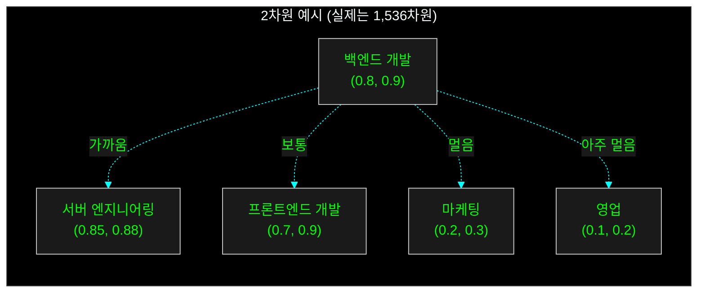
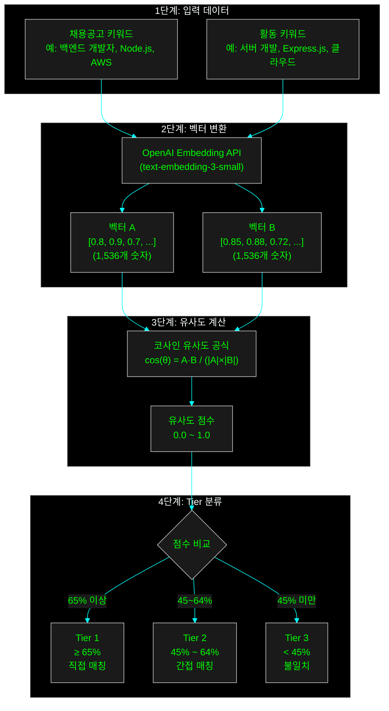

GPT 기반 키워드 분류는 비싸고 느렸다. 벡터 임베딩으로 갈아탔더니 비용은 90% 줄고, 속도는 10배 빨라졌다. 심지어 정확도와 일관성까지 잡았다. 돈 아끼고 성능 올린 삽질의 기록이다.

## 😫 비싸고, 느리고, 제멋대로인 GPT

최근에 채용공고와 지원자의 활동 경험을 매칭해주는 시스템을 만들고 있었다. 처음에는 간단하게 GPT-4를 사용했다. "이 공고랑 이 경험이 얼마나 관련 있어 보여?" 라고 물어보는 식이었다. 똑똑한 GPT는 그럴듯한 답변을 내놓았지만, 세 가지 큰 문제가 있었다.

- **비용**: GPT-4, 정말 비싸다. 요청 한 번에 수십 원에서 수백 원이 드는데, 사용자가 늘어나면 감당이 안 될 것 같았다.
- **속도**: 답변 하나 받는 데 몇 초씩 걸리니 답답했다.
- **일관성**: 가장 큰 문제였다. 똑같은 질문을 해도 컨디션에 따라 답변이 달라졌다. 어제는 '관련 높음'이라더니 오늘은 '중간'이라고 하는 식이다. 시스템의 신뢰도가 바닥을 쳤다.

뭔가 잘못되고 있었다. 더 싸고, 빠르고, 일관적인 방법이 필요했다.

## ✨ 구세주, 벡터 임베딩의 등장

고민 끝에 찾은 해결책은 **벡터 임베딩(Vector Embedding)**과 **코사인 유사도(Cosine Similarity)**였다.

어려운 말 같지만 별거 아니다. 모든 키워드를 숫자로 된 좌표, 즉 **벡터**로 바꾸는 기술이다. 예를 들어 '백엔드 개발'이라는 단어는 1,536차원 공간의 한 점 `(0.8, 0.9, ...)`이 되는 식이다. 이렇게 좌표로 바꾸고 나면, 두 점 사이의 거리를 재서 얼마나 가까운지(유사한지) 계산할 수 있다.



GPT처럼 복잡한 추론을 하는 게 아니라, 단순히 좌표를 찍고 거리를 재는 거라 훨씬 빠르고 저렴하다. OpenAI의 `text-embedding-3-small` 모델은 GPT-4에 비해 가격은 90% 이상 저렴하고, 속도는 10배 이상 빨랐다. 게다가 항상 같은 입력에 같은 결과를 내놓으니 일관성 문제도 해결됐다.

## ⚙️ 그래서, 어떻게 만들었는데?

전체적인 흐름은 이렇다.

1.  채용공고와 활동 경험의 키워드를 각각 벡터로 변환한다.
2.  두 벡터 간의 코사인 유사도를 계산해서 0과 1 사이의 점수를 얻는다.
3.  미리 정해둔 점수 구간(임계값)에 따라 Tier 1/2/3로 분류한다.



## 🔬 결과는 성공적, 하지만…

50개의 케이스로 테스트를 돌려보니 전체 정확도는 80%가 나왔다.

- **Tier 1 (직접 매칭)**: 100% 정확도. '안드로이드 개발자'와 'Android Developer' 처럼 표현만 다른 경우는 기가 막히게 잡아냈다.
- **Tier 3 (불일치)**: 90% 정확도. '마케팅'과 '의료' 같이 전혀 다른 분야도 잘 걸러냈다.
- **Tier 2 (간접 매칭)**: 64% 정확도. '웹 개발'과 '모바일 개발'처럼 애매한 관계를 판단하는 데서는 아쉬운 모습을 보였다.

가장 고민했던 건 Tier를 나누는 경계값을 정하는 것이었다. 수많은 테스트 끝에 아래처럼 기준을 정했다.

- **Tier 1**: 유사도 65% 이상. 이 정도면 거의 같은 직무라고 봐도 무방했다.
- **Tier 2**: 45% ~ 64%. 관련은 있지만, 직접적인 연관성은 적은 경우다.
- **Tier 3**: 45% 미만. 확실히 관련 없는 경우만 여기에 속하도록 보수적으로 잡았다.

```typescript
const TIER_THRESHOLDS = {
  TIER_1: 0.65, // 65% 이상 - 직접 매칭
  TIER_2: 0.45, // 45% ~ 64% - 간접 매칭
  // TIER_3: 45% 미만 - 불일치
};
```

Tier 2의 정확도가 아쉽긴 하지만, '확실하지 않으면 더 보수적으로 판단한다'는 원칙을 세우니 마음이 편했다. 관련 없는 경험을 추천하는 것보다는 놓치는 게 낫다고 판단했다.

## 💡 결론: 문제의 본질을 보자

결국, 모든 문제를 비싸고 강력한 GPT로 해결하려는 건 게으른 생각이었다. 문제의 본질을 파고들어 더 간단하고 저렴한 해결책을 찾는 과정이 진짜 개발의 묘미가 아닐까.

덕분에 회사 돈도 아끼고, 내 실력도 조금은 는 것 같아 뿌듯하다. 혹시라도 비슷한 문제로 고민하는 사람이 있다면, 비싼 AI 모델에만 의존하지 말고 더 효율적인 대안을 찾아보는 것을 추천한다. 그 과정에서 분명 많은 것을 배우게 될 것이다.
