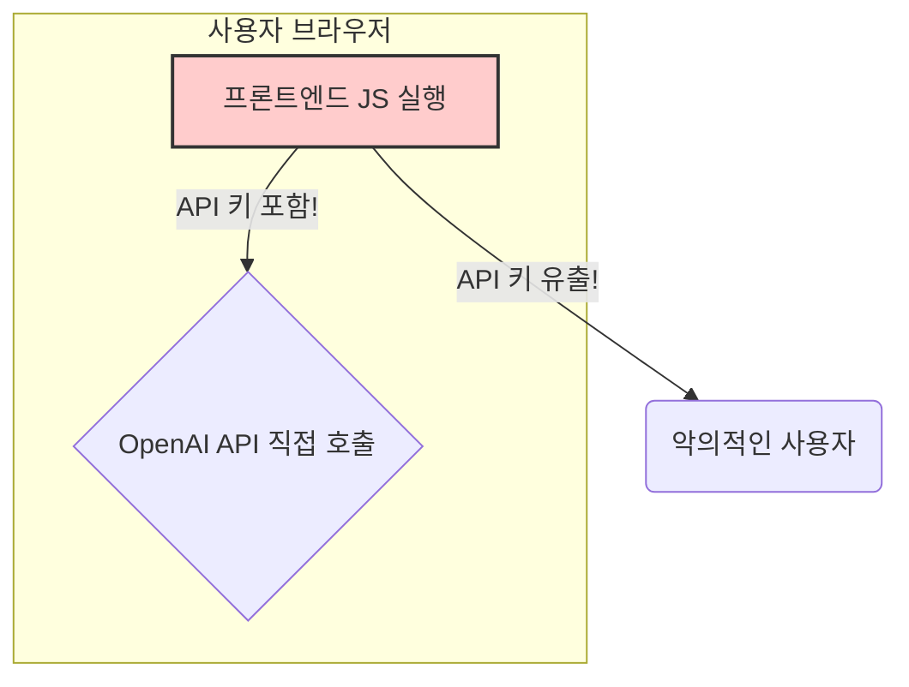
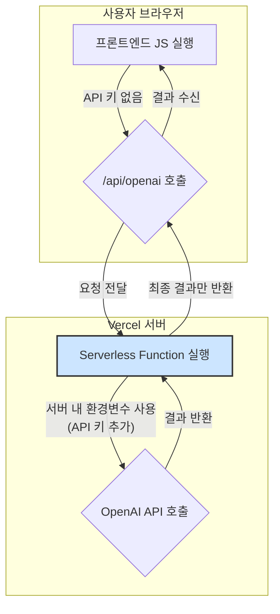

클라이언트에 `NEXT_PUBLIC_` 같은 접두사만 붙여 환경변수를 쓰고 있다면? 축하한다. 당신의 소중한 API 키는 이미 전 세계에 공개됐을지도 모른다. 나 역시 그랬으니까. 서버리스 함수로 API 키를 서버 뒤로 숨기는 과정과 무료 플랜의 무서운 함정, 그리고 504 타임아웃 에러를 해결한 눈물겨운 마이그레이션 후기를 공유한다.

---

### 😱 내 API 키가 모두에게 공개되고 있었다

토이 프로젝트에 AI 모델을 연동하던 날이었다. 사용하는 배포 플랫폼의 환경변수 설정에서 특정 접두사를 붙이면 클라이언트에서 쓸 수 있다는 사실에 안도하며 신나게 코드를 작성했다.

```javascript
// 🚨 바로 이렇게. 절대 따라하지 말 것.
const apiKey = process.env.NEXT_PUBLIC_SOME_API_KEY;
```

개발자 도구를 열기 전까지는 모든 게 완벽해 보였다. 네트워크 탭에서 `sk-...`로 시작하는 내 소중한 API 키가 버젓이 노출된 것을 발견하기 전까지는. 식은땀이 흘렀다. JavaScript 번들 파일을 까보니 거기에도 API 키가 고스란히 박제되어 있었다.



### 🛡️ 서버리스 함수, 구원투수로 등판하다

정신을 차리고 해결책을 찾아 나섰다. 클라이언트가 AI 서비스에 직접 요청하는 것이 문제이니, 중간에 우리 서버를 대리인으로 내세우면 되는 거였다. 바로 사용 중인 배포 플랫폼의 서버리스 함수를 이용해 프록시 API를 만드는 것.



먼저, 가장 위험한 환경변수부터 수정했다.

```bash
# Before (위험)
NEXT_PUBLIC_SOME_API_KEY=sk-...

# After (안전)
SOME_API_KEY=sk-...
```

`NEXT_PUBLIC_` 접두사를 제거하는 것만으로도 이 키는 더 이상 클라이언트에 노출되지 않는다. 이제 이 키는 오직 서버 환경에서만 접근 가능하다.

다음으로, 클라이언트의 요청을 받아 대신 AI 서비스에 전달해 줄 프록시 API를 만들었다.

**`/api/proxy/chat.ts`**

```typescript
// 이제 클라이언트는 우리 서버하고만 통신한다.
import type { NextApiRequest, NextApiResponse } from "next";
import SomeAI from "some-ai-library";

export default async function handler(
  req: NextApiRequest,
  res: NextApiResponse
) {
  // 서버에서만 접근 가능한 안전한 키를 사용한다.
  const ai = new SomeAI({
    apiKey: process.env.SOME_API_KEY,
  });

  try {
    const response = await ai.chat.completions.create({
      model: "some-ai-model",
      messages: req.body.messages,
    });
    res.status(200).json(response);
  } catch (error) {
    res.status(500).json({ error: "AI API 요청에 실패했다." });
  }
}
```

클라이언트 코드도 당연히 수정해야 한다. 이제 외부 AI 서비스가 아닌 우리 내부 API를 호출하도록.

```typescript
// Before (위험천만했던 직접 호출)
// const ai = new SomeAI({
//   apiKey: process.env.NEXT_PUBLIC_SOME_API_KEY,
//   dangerouslyAllowBrowser: true,
// });

// After (안전한 내부 API 호출)
const response = await fetch("/api/proxy/chat", {
  method: "POST",
  headers: { "Content-Type": "application/json" },
  body: JSON.stringify({ messages: [{ role: "user", content: prompt }] }),
});
```

드디어 API 키를 안전하게 숨기는 데 성공했다!

### 💣 또 다른 복병, 504 Gateway Timeout

보안 문제를 해결했다는 기쁨도 잠시, 새로운 문제가 터졌다. 조금 복잡한 요청을 보내면 10초쯤 뒤에 어김없이 `504 Gateway Timeout` 에러가 발생했다. 사용하던 배포 플랫폼의 무료 플랜에서는 서버리스 함수의 최대 실행 시간이 기본적으로 10초(유료 플랜은 15초)로 설정되어 있기 때문이다. AI의 응답이 이보다 늦어지면 플랫폼이 가차 없이 연결을 끊어버리는 것이다.

다행히 설정 파일을 통해 이 시간을 늘릴 수 있었다.

```json
// config.json
{
  "functions": {
    "src/pages/api/**/*.ts": {
      "maxDuration": 30
    }
  }
}
```

무료 플랜에서는 최대 60초까지 늘릴 수 있었다. 일단 30초로 넉넉하게 설정해두니 타임아웃 문제는 해결되었다.

### ⚠️ 진짜 무서운 건 따로 있었다: 무료 플랜의 함정

모든 문제가 해결된 줄 알았다. 하지만 진짜 공포는 따로 있었다. 해당 플랫폼의 요금 정책을 자세히 읽어보다가 등골이 서늘한 문구를 발견했다.

> **무료 플랜에서 무료 제공량을 초과하면 어떻게 되는가?**
>
> 추가 요금이 부과되지는 않는다. **대신 당신의 계정은 일시 정지된다.**

그렇다. 과금이 되는 게 아니라 계정이 정지되고 모든 배포가 중단되는 것이었다. 한 번 정지된 계정을 풀려면 고객 지원팀에 연락하거나 유료 플랜으로 업그레이드해야 한다. `maxDuration`을 늘린다는 것은 함수 실행 시간이 길어진다는 뜻이고, 이는 곧 사용량 증가로 이어진다. 멋모르고 `maxDuration`을 60초로 설정하고 사용자가 몰렸다면 나도 모르는 사이에 계정이 정지될 수도 있었던 아찔한 상황이었다.

결국 함수 내부에 자체적으로 실행 시간을 25초로 제한하는 로직을 추가하고, 불필요한 API 호출을 줄이기 위해 폴링(polling) 간격을 2초로 늘리는 등 무료 플랜의 한도 내에서 최대한 안전하게 동작하도록 코드를 수정해야만 했다.

### ✨ 교훈: 싸고 좋은 건 없다

이번 마이그레이션을 통해 `NEXT_PUBLIC_` 같은 환경변수의 편리함 뒤에 숨겨진 위험성과 공짜 플랜의 무서움을 온몸으로 깨달았다. 저비용 고효율을 추구하는 것도 좋지만, 기본적인 보안 원칙과 서비스의 제약사항을 꼼꼼히 확인하지 않으면 더 큰 대가를 치를 수 있다는 교훈을 얻었다. API 키를 다룰 때는 항상 서버를 거치는 것을 원칙으로 삼고, 이용하는 서비스의 플랜별 제한사항을 반드시 숙지하길 바란다.
